Conexión a AdventureWorksLT

**Explicación:** Asegúrese de que la base de datos de ejemplo AdventureWorksLT esté restaurada y accesible en su instancia de SQL. Verificaremos la conectividad y algunas tablas clave para confirmar que hay datos de ejemplo.

**Resultado:** Cada consulta debe devolver hasta cinco filas de datos. Si alguna no devuelve resultados, compruebe la restauración y permisos.

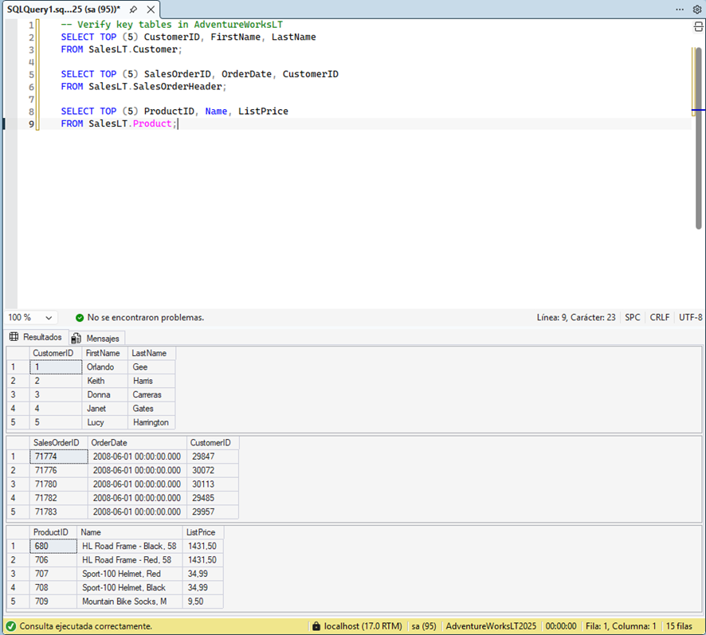

Crear una vista para simplificar consultas

**Explicación:** Cree una vista que combine clientes y sus pedidos dentro del esquema SalesLT para ocultar la complejidad de los JOINs al código de aplicación.

**Resultado:** La consulta debe devolver hasta cinco filas con los pedidos más recientes y demostrar que la vista simplifica el acceso.

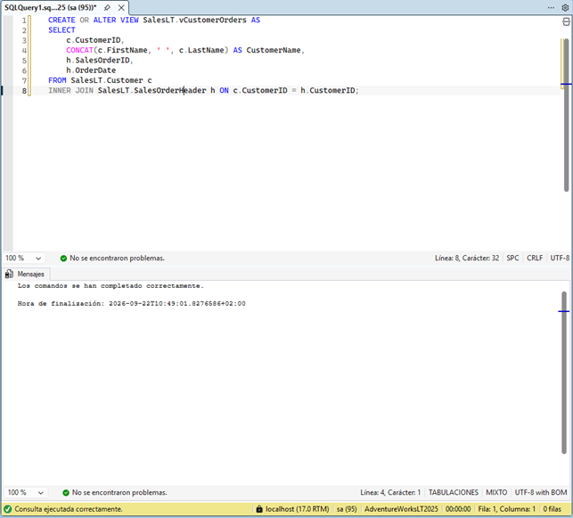
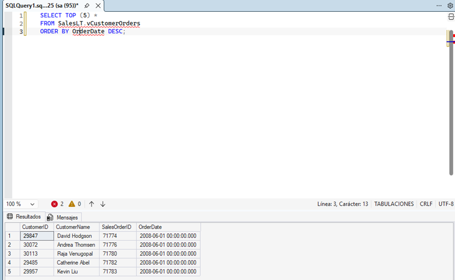

Crear un procedimiento almacenado para procesar un pedido

**Explicación:** Encapsule una operación de negocio que agrega un artículo de pedido a un pedido existente y actualiza el subtotal del encabezado. El procedimiento valida productos y pedidos, inserta la línea y recalcula el subtotal dentro de una transacción.

**Resultado:** El procedimiento inserta la línea y actualiza el subtotal de forma atómica. Si hay errores, la transacción se revierte.
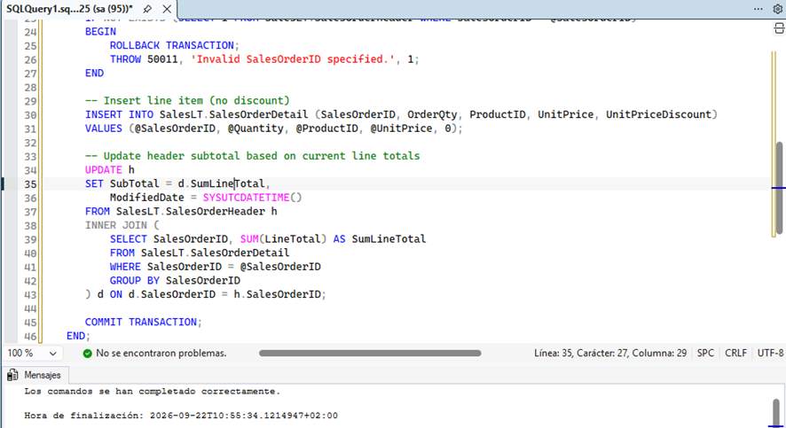
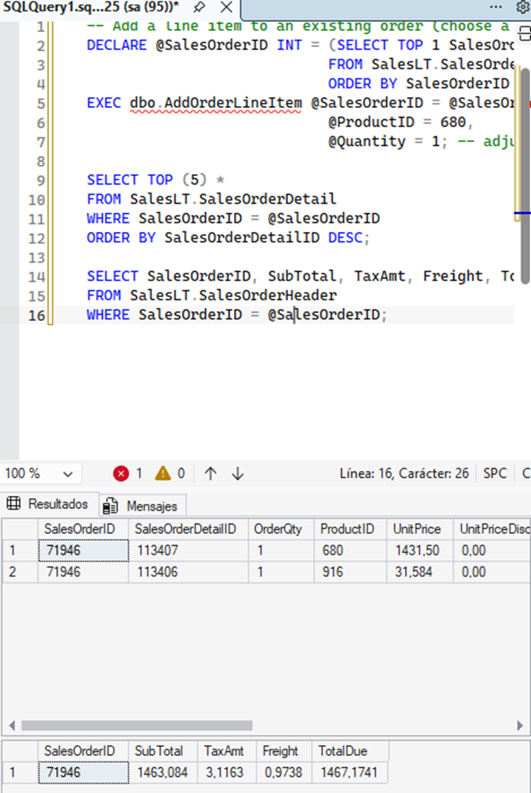

Crear una función escalar para cálculos reutilizables

**Explicación:** Cree una función escalar que devuelva el valor total de un pedido sumando los line totals de SalesOrderDetail. Esto permite reutilizar la lógica en consultas.

**Resultado:** La función devuelve el total de cada pedido y se puede invocar desde consultas y joins.

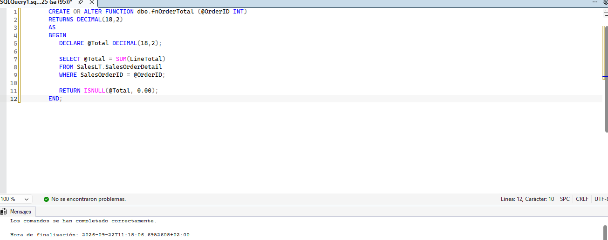
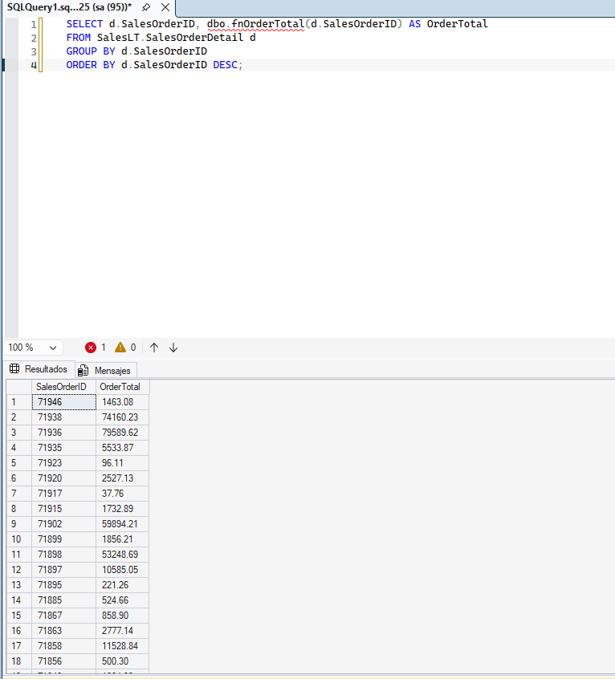

Crear una función con valor de tabla en línea (TVF)

**Explicación:** Cree una TVF que devuelva pedidos de un cliente dado. Las TVF son útiles para usar en SELECT y JOIN, y facilitan la reutilización de consultas parametrizadas.

**Resultado:** La TVF devuelve los pedidos del cliente y se puede aplicar en joins.

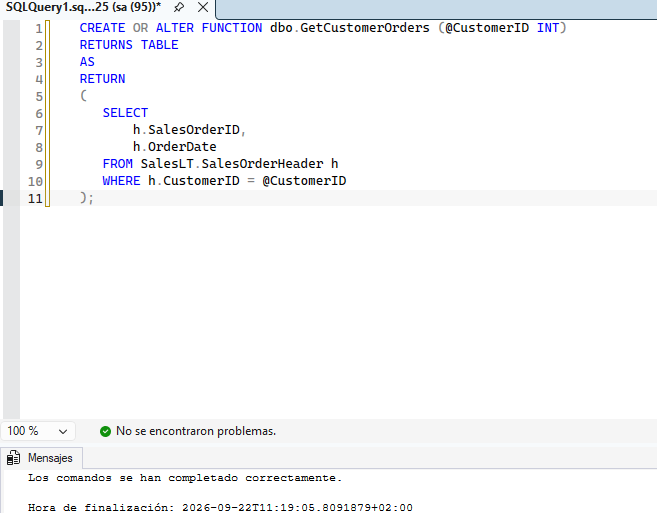
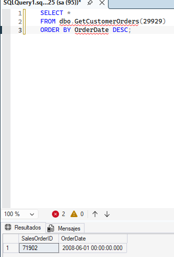
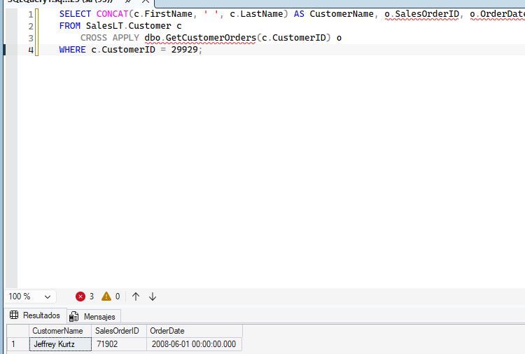

Crear un trigger para registrar cambios

**Explicación:** Añada un trigger que registre en una tabla de auditoría los cambios en los totales de los pedidos cuando cambien los detalles. Los triggers permiten aplicar reglas y capturar historial automáticamente.

**Resultado:** El SELECT devuelve las filas recientes de auditoría mostrando el OrderID afectado, el total anterior y el nuevo total con marca temporal.

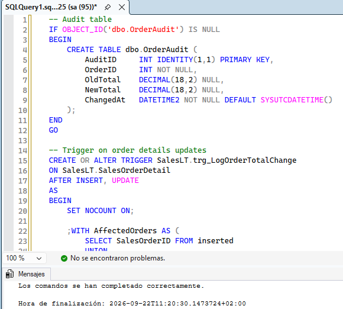
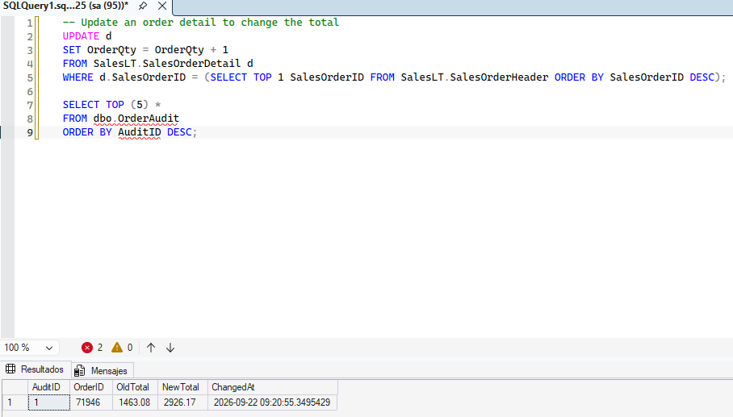

